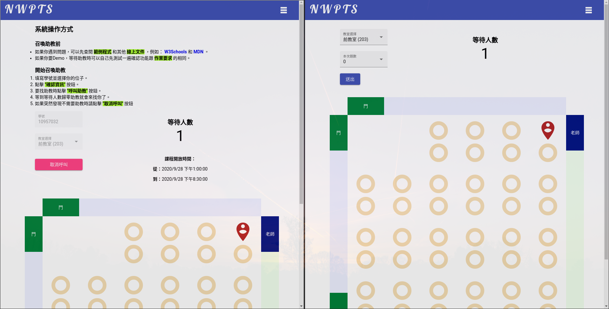
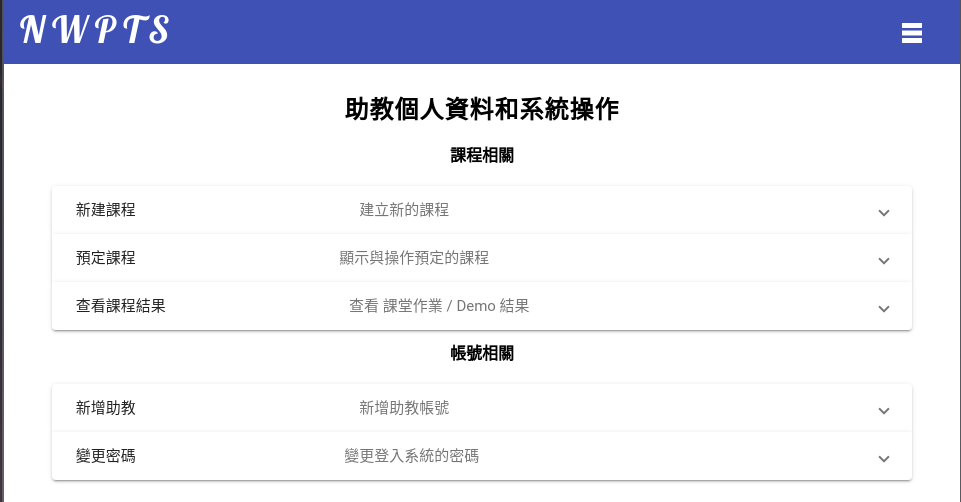

# Introduction

- [Introduction](#introduction)
  * [In Class](#in-class)
    * [Student](#student)
    * [TA](#ta)
  * [TA Profile](#ta-profile)
    * [Course Related](#course-related)
    * [Account Related](#account-related)

## In Class

### Student
1. Follow the instruction on the page.
2. Input student ID number.
3. Select seat, click on the circk (sometimes you have to click twice).
4. Hit "呼叫助教" button.
5. If you want to change your seat or ID, you have to cancel the call first.
6. You can cancel the call anytime.
7. Refreshing the page is fine, the system will restore the previous state (don't work in private browsing mode).
8. After the class session ended, remaining people will be redirect to the home page.
9. There will be a slight delay between the call being made and TA received the call, usually under 1 second, depend on the connection to Firebase server.

### TA
1. Lookout for the waiting number, it doesn't mean there is no one waiting because the icon is not showing, the system will not switch classroom on it's own.
2. If the student is not calling for demo, make sure the submit number is 0 and hit "送出".
3. The system will cap the total score to the total question count, which is set while creating the session.

## TA Profile

### Course Related
- **New Course**:
    - Create new class session. You can only set how much question can be demo, setting score for individual question is not supported, ~~since I don't have a use case for that function I didn't include it~~, PRs are always welcome ~~or just fork this and create your own~~.
- **Booked Course**:
    - View created but finished courses.
- **View Course Result**:
    - Query: List all result in the date range, [ID, Score, Date].
    - Query And Combine Datas: Conbine all score and flatten the list, [ID, Score].

### Account Related
- **Create New TA Account**:
    - Create account with email, new created account **MUST CHANGE THEIR PASSWORD!!** The default password is `soselab401`, you can change the default password in `profile.component.ts`, ~~or send me a PR cuz I couldn't bother implementing a interface for this~~.
- **Change Password**:
    - Change password, will have to re-login if haven't re-login for a long time (this is Firebase's restriction).
